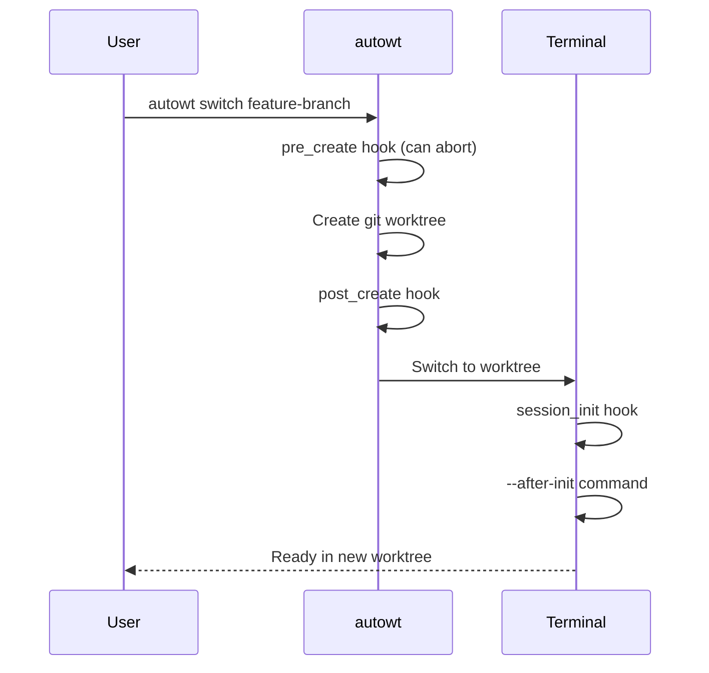
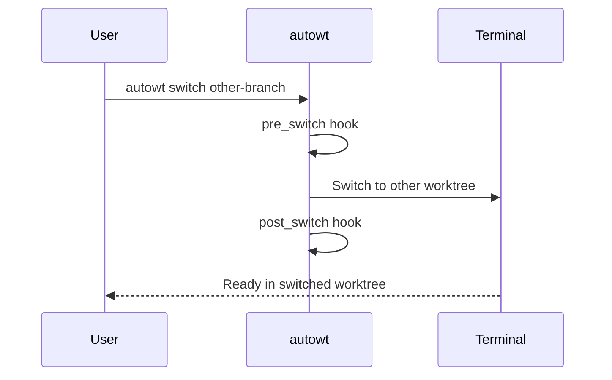
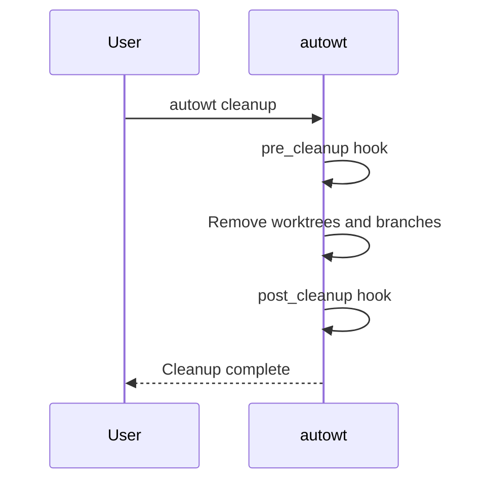

# Lifecycle Hooks and Init Scripts

`autowt` allows you to run custom commands at specific points during worktree operations. The motivating use cases are installing dependencies, copying secrets, and cleaning up resources.

## Example: installing dependencies and copying secrets

The most common hook is the **`session_init` script**, which runs in your new terminal session after creating a new worktree. This is perfect for setting up your shell environment, activating virtual environments, and running interactive setup tasks.

### Configuration

You can specify a `session_init` script in two ways:

1. **Command-line flag**: Use the `--init` flag for a one-time script (maps to `session_init`)
2. **Configuration file**: Set the `scripts.session_init` key in your `.autowt.toml` file for a project-wide default

The `session_init` script is executed in your terminal session _after_ `autowt` has switched to the worktree, but _before_ any `--after-init` script is run.

### Installing dependencies

The most common use case for init scripts is to ensure dependencies are always up-to-date when you create a worktree.

**With the `--init` flag:**

```bash
autowt feature/new-ui --init "npm install"
```

**With `.autowt.toml`:**

```toml
# .autowt.toml
[scripts]
session_init = "npm install"
```

Now, `npm install` will run automatically every time you create a new worktree in this project.

### Copying `.env` files

Worktrees start as clean checkouts, which means untracked files like `.env` are not automatically carried over. You can use an init script to copy these files from your main worktree.

autowt provides environment variables that make this easier, including `AUTOWT_MAIN_REPO_DIR` which points to the main repository directory.

```toml
# .autowt.toml
[scripts]
# Copy .env file from main worktree if it exists
session_init = """
npm install # kept from before
if [ -f "$AUTOWT_MAIN_REPO_DIR/.env" ]; then
  cp "$AUTOWT_MAIN_REPO_DIR/.env" .;
fi
"""
```

## Complete Lifecycle Hooks

Beyond `session_init` scripts, autowt supports 7 lifecycle hooks that run at specific points during worktree operations:

| Hook           | When it runs                                    | Execution Context | Common use cases                                          |
| -------------- | ----------------------------------------------- | ----------------- | --------------------------------------------------------- |
| `pre_create`   | Before creating worktree                        | Subprocess        | Pre-flight validation, resource checks, setup preparation |
| `post_create`  | After creating worktree, before terminal switch | Subprocess        | File operations, git setup, dependency installation       |
| `session_init` | In terminal session after switching to worktree | Terminal session  | Environment setup, virtual env activation, shell config   |
| `pre_cleanup`  | Before cleaning up worktrees                    | Subprocess        | Release ports, backup data                                |
| `post_cleanup` | After worktrees are removed                     | Subprocess        | Clean volumes, update state                               |
| `pre_switch`   | Before switching worktrees                      | Subprocess        | Stop current services                                     |
| `post_switch`  | After switching worktrees                       | Subprocess        | Start new services                                        |

Note that there is a command-line-only `--after-init` flag to run additional commands after init is done. The use case for this is to have the new worktree launch specific tasks immediately after setup is done, so you could, for example, run `--after-init=claude` to launch Claude Code once dependencies have been installed.

## Hook Execution Flow

### Creating/Switching to New Worktree



### Switching Between Worktrees



### Cleanup Operation



## Configuration

Project-level and global hooks run independently and do not override each other.

### Project-level hooks

Configure hooks in your project's `.autowt.toml` file:

```toml
# .autowt.toml
[scripts]
pre_create = "./scripts/validate-branch.sh"
post_create = "npm install && cp .env.example .env"
session_init = "source .env && npm run dev"
pre_cleanup = "./scripts/release-ports.sh"
post_cleanup = "./scripts/cleanup-volumes.sh"
pre_switch = "pkill -f 'npm run dev'"
post_switch = "npm run dev &"
```

### Global hooks

Configure hooks globally in `~/.config/autowt/config.toml` (Linux) or `~/Library/Application Support/autowt/config.toml` (macOS):

```toml
# Global config
[scripts]
pre_create = "echo 'Preparing to create worktree...'"
pre_cleanup = "echo 'Cleaning up worktree...'"
post_cleanup = "echo 'Worktree cleanup complete'"
```

## Environment Variables and Arguments

All hooks receive the following environment variables:

- `AUTOWT_WORKTREE_DIR`: Path to the worktree directory
- `AUTOWT_MAIN_REPO_DIR`: Path to the main repository directory
- `AUTOWT_BRANCH_NAME`: Name of the branch
- `AUTOWT_HOOK_TYPE`: Type of hook being executed

### Example hook script

```bash
# Hook script using environment variables
echo "Hook type: $AUTOWT_HOOK_TYPE"
echo "Worktree: $AUTOWT_WORKTREE_DIR"
echo "Branch: $AUTOWT_BRANCH_NAME"

cd "$AUTOWT_WORKTREE_DIR"
# Do work here...

# Multi-line scripts work naturally
for file in *.txt; do
    echo "Processing $file"
done
```

### Hooks are executing using the system shell

Hook scripts are executed by passing the script text directly to the system shell (`/bin/sh` on Unix systems) rather than creating a temporary file. This is equivalent to running `/bin/sh -c "your_script_here"`.

This execution model means:

- **Multi-line scripts work naturally**—the shell handles newlines and command separation
- **All shell features are available**—variables, conditionals, loops, pipes, redirections, etc.
- **Shebangs are ignored**—since no file is created, `#!/bin/bash` lines are treated as comments
- **Cross-platform behavior is tricky**—PowerShell and bash are quite different! GitHub issues and pull requests on this topic are welcome.

```toml
[scripts]
# This works - shell script commands
post_create = """
echo "Setting up worktree"
npm install
mkdir -p logs
"""

# This works - calls external script file (shebang will work here)
post_create = "./setup-script.py"

# This doesn't work - shebang is ignored, shell tries to run Python code
post_create = """#!/usr/bin/env python3
import sys  # Shell doesn't understand this!
"""
```

If you need to use a different programming language, create a separate script file and call it from your hook. The external file can use shebangs normally.

!!! note "Why does it work like this?"

    This behavior is identical to Python's [`subprocess.run()`](https://docs.python.org/3/library/subprocess.html#subprocess.run) with `shell=True`.

## Hook Details

### `pre_create` Hook

**Timing**: Before worktree creation begins  
**Execution Context**: Subprocess in parent directory (worktree doesn't exist yet)  
**Use cases**: Pre-flight validation, resource availability checks, branch name validation

The `pre_create` hook can **prevent worktree creation** by exiting with a non-zero status. If this hook fails, autowt will completely abort worktree creation before the worktree is created.

```toml
[scripts]
pre_create = """
# Validate branch naming convention
if ! echo "$AUTOWT_BRANCH_NAME" | grep -q '^feature/\|^bugfix/\|^hotfix/'; then
  echo "Error: Branch must start with feature/, bugfix/, or hotfix/"
  exit 1
fi
"""
```

### `post_create` Hook

**Timing**: After worktree creation, before terminal switch  
**Execution Context**: Subprocess in worktree directory  
**Use cases**: File operations, git setup, dependency installation, configuration copying

The `post_create` hook can **prevent terminal switching** by exiting with a non-zero status. If this hook fails, autowt will abort the operation (the worktree will exist but the terminal won't switch to it).

```toml
[scripts]
post_create = """
npm install
cp .env.example .env
"""
```

The post_create hook runs as a subprocess after the worktree is created but before switching to the terminal session. It's ideal for:

- Installing dependencies that don't require shell interaction
- Setting up configuration files
- Running git commands
- File operations that don't need shell environment

### `session_init` Hook

**Timing**: In terminal session after switching to worktree  
**Execution Context**: Terminal session (pasted/typed into terminal)  
**Use cases**: Virtual environment activation, shell configuration

```toml
[scripts]
session_init = """
source .env
conda activate myproject
export DEV_MODE=true
"""
```

The `session_init` hook is special—it's the only hook that runs **inside the new terminal session**. While other lifecycle hooks run inside the initial `autowt create` process, `session_init` scripts are literally pasted/typed into the terminal using terminal automation (i.e. AppleScript). This allows `session_init` scripts to: activate virtual environments or start interactive processes.

### `pre_cleanup` Hook

**Timing**: Before any cleanup operations begin  
**Use cases**: Resource cleanup

```toml
[scripts]
pre_cleanup = """
# Release allocated ports
./scripts/release-ports.sh $AUTOWT_BRANCH_NAME
"""
```

### `post_cleanup` Hook

**Timing**: After worktrees and branches are removed  
**Use cases**: Volume cleanup, global state updates

```toml
[scripts]
post_cleanup = """
# Clean up docker volumes
docker volume rm ${AUTOWT_BRANCH_NAME}_db_data 2>/dev/null || true
"""
```

**Note**: The worktree directory no longer exists when this hook runs, but the path is still provided for reference.

### `pre_switch` Hook

**Timing**: Before switching away from current worktree  
**Use cases**: Stop services, save state

```toml
[scripts]
pre_switch = """
# Stop development server
pkill -f "npm run dev" || true

# Save current state
./scripts/save-session-state.sh
"""
```

### `post_switch` Hook

**Timing**: After switching to new worktree  
**Use cases**: Start services, restore state

```toml
[scripts]
post_switch = """
# Start development server in background
nohup npm run dev > dev.log 2>&1 &

# Restore session state
./scripts/restore-session-state.sh
"""
```
